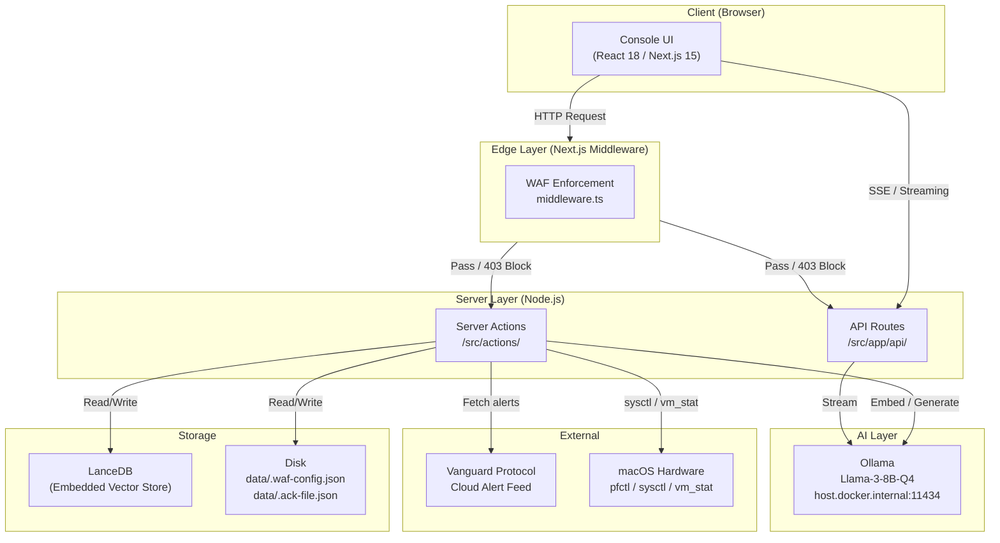
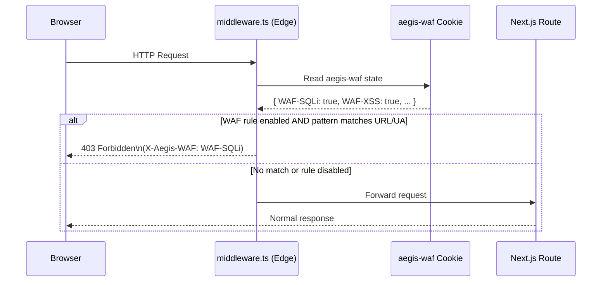
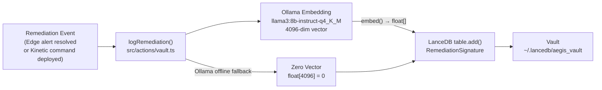
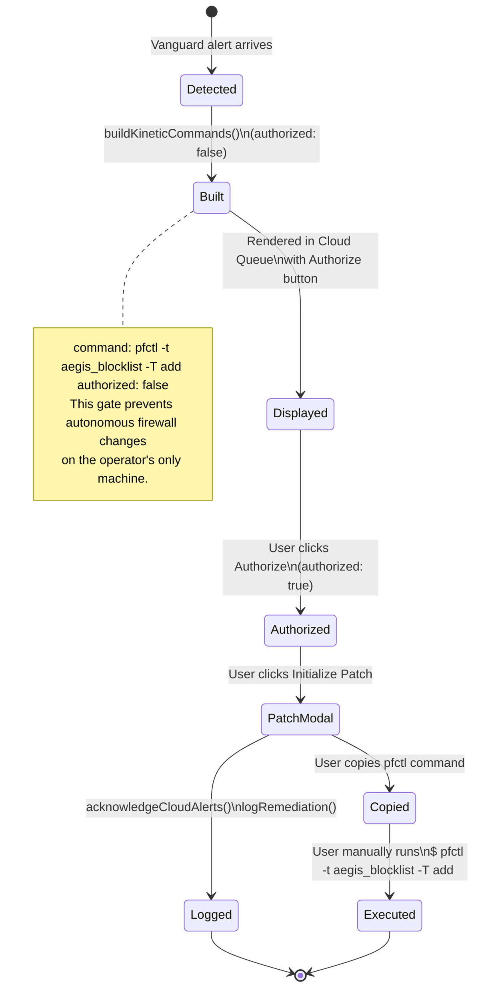
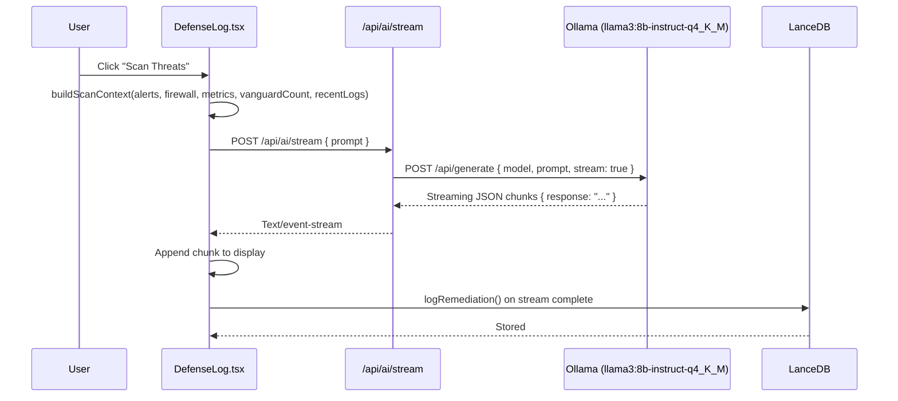
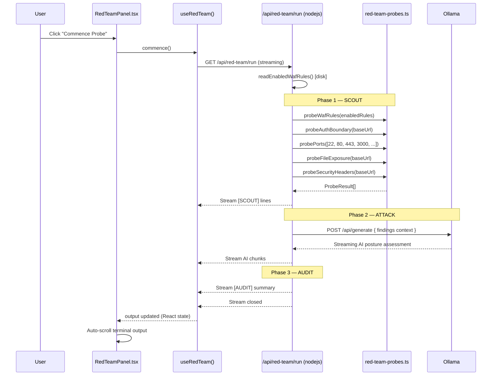
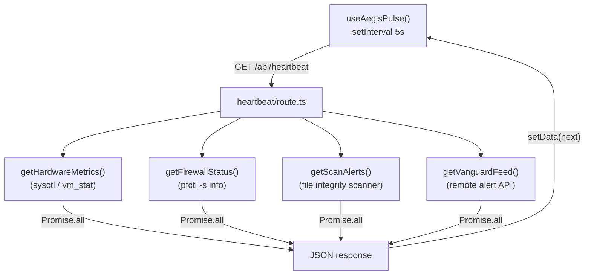
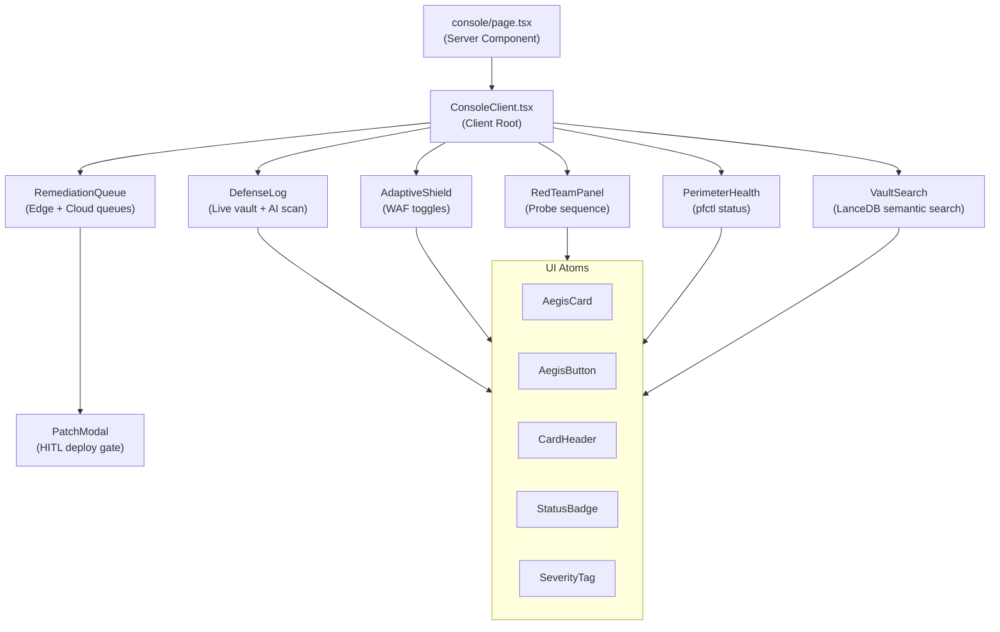

# AEGIS NODE — Architecture Flows

System architecture and data flow diagrams for the Aegis Active Defense Node.

---

## 1. Top-Level System Overview

---

## 2. WAF Enforcement Flow

Every inbound HTTP request passes through Next.js middleware before reaching any route.

**Key design constraint:** WAF state is transported via an httpOnly cookie set by a server action on page load. The Edge Runtime (middleware) cannot read `fs`, so disk state is synced to the cookie before it is needed.

---

## 3. Vault Logging Flow (LanceDB)

All remediation actions are embedded and stored as vector signatures for semantic search.

---

## 4. Kinetic Command HITL Gate

pfctl commands are generated and displayed but **never auto-executed**. Human authorization is required.

---

## 5. Defense Log AI Analysis Flow

The AI threat surface scan is triggered on demand from the Defense Log card.

---

## 6. Red Team Probe Sequence

The Red Team panel runs a five-phase read-only probe against the local node.

---

## 7. Heartbeat Polling Loop

System state is refreshed every 5 seconds from the client.

---

## 8. Component Hierarchy

