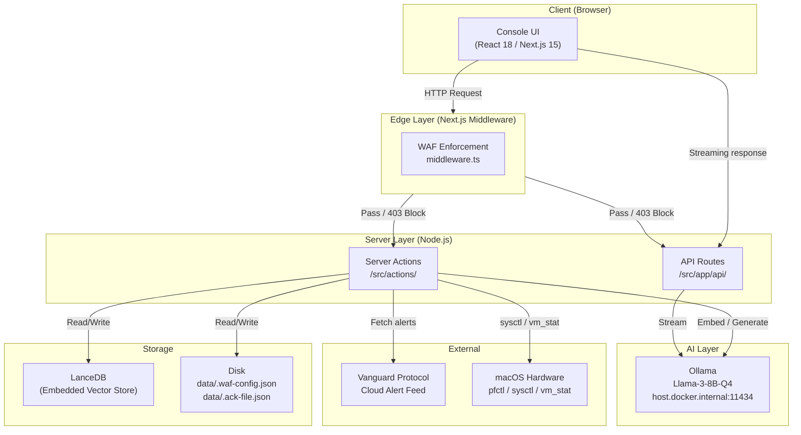
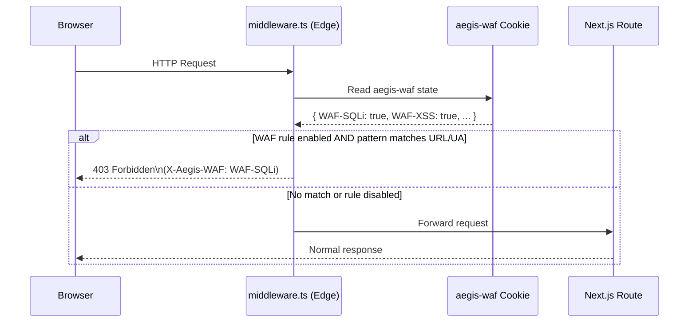
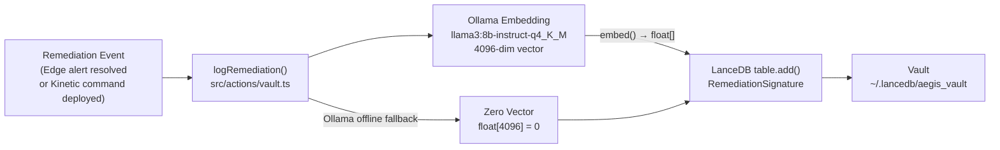
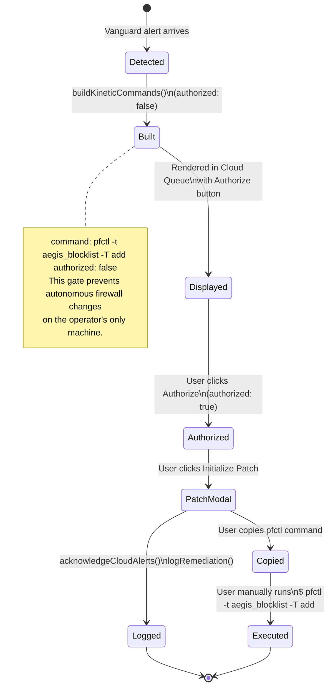
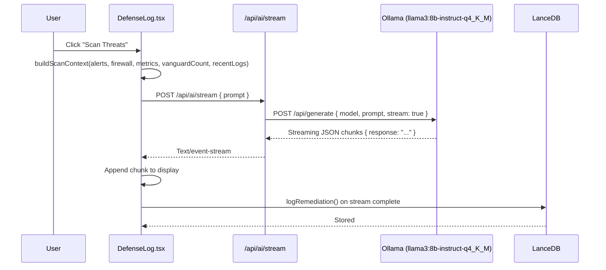
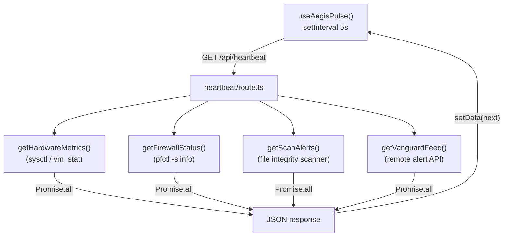
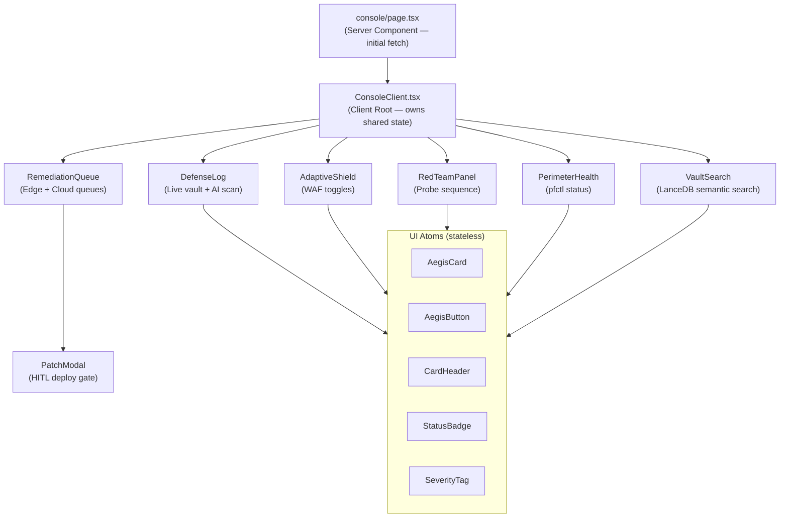

# ⬢ Aegis Node — Architecture Flows

This document captures the core runtime flows that define Aegis Node's behavior:

- WAF enforcement and request inspection at the Edge layer
- Vault logging and semantic search via LanceDB
- Kinetic command HITL gate — advisory-only pfctl model
- AI-driven threat surface analysis and streaming posture assessment
- Red team probe sequence — Probe, Assess, Verify
- Heartbeat polling and system telemetry

Use this file as the engineering source of truth for flow-level behavior.  
When implementation changes, update this doc in the same PR.

---

## How to Read These Diagrams

- **UI** = the operator-facing console (`/console`) built with React 18 + Next.js 15 App Router.
- **Middleware** (`middleware.ts`) = Next.js Edge Runtime request gate. Runs before every route.
- **Server Actions** (`/src/actions/`) = server-side hardware and storage logic. Never runs in the browser.
- **API Routes** (`/src/app/api/`) = streaming endpoints for AI and probe output.
- **Vault** = LanceDB embedded vector store. Stores all remediation signatures as 4096-dim embeddings.
- **Ollama** = local Llama-3-8B-Q4 model running on `host.docker.internal:11434`.

Status / classification conventions used across flows:

- `pass` — control verified, behavior is correct
- `warn` — advisory; risk is present but not immediately exploitable
- `fail` — control missing or actively broken; operator action required
- `info` — neutral observation (e.g. open port that may be intentional)
- `403` — WAF block with `X-Aegis-WAF: <rule-id>` header
- `HITL` — Human-in-the-Loop; no action proceeds without explicit operator authorization

---

## 1. Top-Level System Overview

### Why this exists

Aegis is structured as a layered defense stack. Each layer has a single, non-overlapping responsibility. Understanding which layer handles what prevents misplaced trust — the middleware cannot read disk, server actions cannot run in the browser, and the UI never executes remediation commands.

### What the operator should understand

Every inbound request passes through the Edge Runtime WAF before reaching any server logic. All AI interaction happens locally via Ollama — no data leaves the host network. All remediation decisions require explicit human authorization; Aegis never autonomously modifies system state.

### What this flow guarantees

- WAF enforcement is applied unconditionally before route logic.
- AI inference is local-only (OrbStack Docker → host.docker.internal).
- Vault logging is append-only; no remediation record is ever deleted.
- No pfctl or system command is executed automatically.

---

## 2. WAF Enforcement Flow

### Why this exists

The Next.js application is self-protecting. Rather than relying on an upstream nginx or load balancer (which don't exist in a local dev node), the WAF runs as middleware inside the same process. This means it protects every route — API, pages, and static files — with zero additional infrastructure.

### What the operator should understand

WAF state is persisted to disk (`data/.waf-config.json`) by a server action and then transported to the Edge Runtime via an httpOnly cookie (`aegis-waf`). This indirection exists because the Edge Runtime isolate cannot access `fs`. The cookie is set on every page load and on every toggle, so it stays in sync.

WAF-RATE appears as a toggle in the UI but is **not enforced** by the middleware. The Edge Runtime has no persistent cross-request state (no in-memory counters survive between requests in a serverless/edge environment). The toggle logs intent to the vault — actual rate enforcement would require an upstream reverse proxy.

### What this flow guarantees

- WAF pattern matching applies to URL path + query string + User-Agent.
- A matched request is rejected with `403` and a `X-Aegis-WAF` header naming the rule.
- Disabled rules are skipped entirely; the request passes through.
- Rule state survives restarts via disk persistence.

---

## 3. Vault Logging Flow (LanceDB)

### Why this exists

Every remediation event — whether an Edge alert resolved via Ollama or a Kinetic command deployed via PatchModal — is embedded and stored as a vector signature. This creates a semantic memory of the node's defense history that can be queried in natural language via the VaultSearch card.

### What the operator should understand

Embeddings are generated by Ollama (`llama3:8b-instruct-q4_K_M`, 4096-dim). If Ollama is offline at logging time, the vault falls back to a zero vector. Zero-vector entries are still stored and retrievable via keyword lookup, but they will not surface correctly in semantic (cosine similarity) searches.

### What this flow guarantees

- Every remediation action is persisted regardless of Ollama availability.
- Semantic search quality degrades gracefully when embeddings are absent.
- The vault is append-only; no entry is modified or deleted after write.

---

## 4. Kinetic Command HITL Gate

### Why this exists

Aegis runs on the operator's primary development machine. Autonomously executing `pfctl` firewall rules on a machine the operator actively uses risks breaking network connectivity, blocking legitimate traffic, or creating an unrecoverable state. The HITL gate makes it impossible for Aegis to modify the firewall without the operator explicitly reading, copying, and pasting the command themselves.

### What the operator should understand

The `buildKineticCommands()` function derives a pfctl command from each Vanguard alert. Commands are generated with `authorized: false` by default and are displayed in the Cloud Queue. The operator must click **Authorize** per command, then **Initialize Patch** to open the PatchModal, where each command has an individual copy button. Execution happens entirely outside the application.

### What this flow guarantees

- No pfctl command is ever executed by the application.
- Every authorized command is logged to the vault before the modal closes.
- The `authorized` flag on a command cannot be set to `true` by any path other than explicit operator interaction.

---

## 5. Defense Log AI Analysis Flow

### Why this exists

The Defense Log card provides a live view of vault activity, but raw log entries lack context. The Scan Threats trigger injects the current system state (CPU, memory, firewall status, active alert counts, recent vault activity) into a structured prompt and streams a three-bullet posture assessment from Ollama. This gives the operator an AI-synthesized view of the threat surface without leaving the console.

### What the operator should understand

The prompt is constructed by `buildScanContext()` in `DefenseLog.utils.ts`. It includes only system telemetry and vault summaries — no raw file contents, no credential data, and no secrets. The AI output is captured inside a collapsible **Threat Analysis** block within the log card and is also logged to the vault for audit continuity.

### What this flow guarantees

- The scan prompt is deterministically constructed from live system state at the moment of the click.
- The AI response is streamed token-by-token — the operator sees partial output as it arrives.
- Ollama offline behavior: the stream returns a single "AI Engine Offline" message; the UI does not hang.

---

## 6. Red Team Probe Sequence

### Why this exists

A defense node that only reacts to external signals has a blind spot: its own posture. The Red Team probe runs inside the application, against the application, to surface misconfigurations before an actual attacker does. It provides a continuous self-assessment capability that doesn't require any external tooling (no Burp Suite, no nmap, no separate audit process).

### What the operator should understand

All probes are read-only. The sequence never writes to disk, never modifies firewall rules, never sends traffic outside localhost (the only exception is the Ollama call to `host.docker.internal`, which stays within the Docker host network). The route runs on the `nodejs` runtime because port scanning via `net.connect` requires Node.js APIs that are unavailable in the Edge Runtime isolate.

The ASSESS phase feeds all probe findings to Ollama in a single structured prompt. The AI is constrained to produce a posture assessment — it has no tool access and cannot trigger any action.

### What this flow guarantees

- No system state is modified during or after the probe.
- Probe findings are displayed to the operator and not automatically acted upon.
- Ollama offline behavior: the ASSESS phase emits a single advisory message and the VERIFY phase continues normally.
- Each probe category uses an injected fetcher/connector interface, making every probe function independently testable offline.

---

## 7. Heartbeat Polling Loop

### Why this exists

The console needs live data but uses server-side hardware reads (sysctl, vm_stat, pfctl) that cannot run in the browser. Rather than re-fetching on every user interaction, the heartbeat runs on a 5-second interval in the background, keeping all metric cards, alert counts, and firewall status current without requiring manual refresh.

### What the operator should understand

The heartbeat is a single GET to `/api/heartbeat` that executes all four data sources in parallel via `Promise.all`. If one source fails (e.g. pfctl returns an error because the operator doesn't have the right permissions), the heartbeat still returns — the failed field carries an `error` property that the UI renders gracefully rather than crashing.

### What this flow guarantees

- System state is never stale by more than 5 seconds in normal operation.
- A single source failure does not block the other three data sources.
- The polling loop is started once and cleaned up on component unmount; it does not accumulate.

---

## 8. Component Hierarchy

### Why this exists

The console is a single long-lived client component (`ConsoleClient.tsx`) that owns all shared state (authorized commands, modal visibility, suppressed alert IDs). Feature cards are memoized children that receive only the props they need. This prevents unnecessary re-renders during heartbeat updates while keeping the state ownership clear.

### What the operator should understand

`page.tsx` is a server component that performs the initial parallel data fetch and passes hydration props to `ConsoleClient`. After that, `useAegisPulse` takes over for live updates. The split means the first paint has real data (no loading skeleton), and subsequent updates are reactive without a full page reload.

### What this flow guarantees

- All UI atoms (`AegisCard`, `AegisButton`, `CardHeader`, `StatusBadge`, `SeverityTag`) are stateless primitives with no side effects.
- State lives exactly one level above the component that needs it — no prop drilling beyond a single hop.
- `PatchModal` is conditionally rendered, not hidden — it does not mount until the operator opens it.

---

## Update Rules (Keep This Accurate)

Update this document whenever any of the following changes:

- WAF rule set, cookie transport mechanism, or pattern matching scope
- Vault schema, embedding model, or zero-vector fallback behavior
- Kinetic command authorization contract or PatchModal deploy flow
- Red team probe categories, port targets, or ASSESS phase prompt construction
- Heartbeat data sources or polling interval
- Server/client component boundary in `console/page.tsx` → `ConsoleClient.tsx`

If a code change alters runtime behavior but this doc is not updated, treat that as an incomplete PR.

---

## Suggested Companion Docs

- `SECURITY_ADVISORY.md` (AEGIS-ADV-003) — Red team probe behaviors, threat model, and operational notes
- `TECHNICAL_ADVISORY.md` — pfctl advisory model, WAF Edge Runtime constraints, and vault zero-vector fallback
- `README.md` — High-level product narrative and setup instructions
