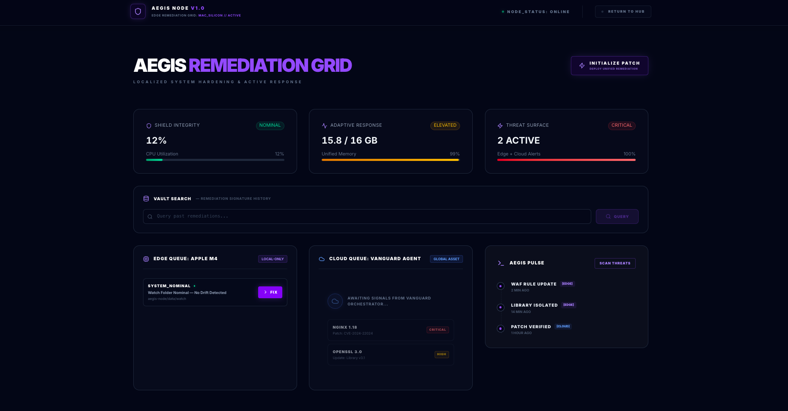
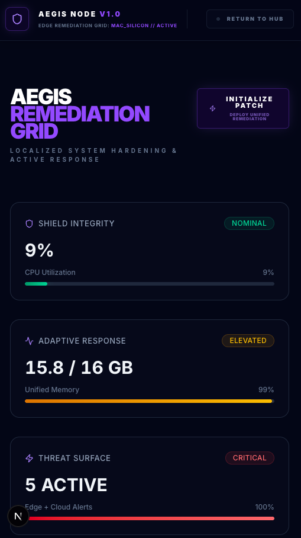

# ⬢ Aegis Node: Autonomous Remediation & Multi-Layer Hardening

**Response Layer for the Vanguard Protocol.**

**Agentic AI - Phase 3 Active Remediation | Next.js 16 | Ollama Llama-3 | Unified Memory Optimized | macOS Native Enforcement**

## What is Aegis Node?

**While Vanguard provides passive observation and reconnaissance, Aegis executes autonomous remediation and perimeter hardening at the edge.**

Aegis is the **Active Remediation Node** of the ecosystem. It turns Vanguard's intelligence into automated threat neutralization through real-time patching, adaptive WAF rules, and self-healing infrastructure. It extends protection from the cloud perimeter down to edge hardware and kernel-level distributed systems on Apple Silicon (M4).

## What is Vanguard Protocol?

Protocol Definition: Vanguard is a decentralized intelligence grid providing real-time vulnerability reconnaissance. Aegis is the authorized remediation node for the local Mac-Silicon (M4) perimeter.

## 🛰️ System Identity

- **Ecosystem:** Vanguard Protocol
- **Role:** Active Defense / Autonomous Remediation
- **Primary Environment:** Apple Silicon (M4) Edge Node **(macOS Native)**
- **Iconic Anchor:** Black Hexagon (The Matrix) ⬢
- **Visual DNA:** Electric Shield (Electric Violet `#8b5cf6` / Obsidian Glass)
- **Primary Environment:** Apple Silicon (M4) Edge Node

## 🛠️ Technical Stack

- **Framework:** Next.js 15 (App Router / React 18)
- **Engine:** Ollama (Llama-3-8B-Q4) for Local Intelligence
- **Database:** LanceDB (Embedded Vector Store for Local Sovereignty)
- **Sandbox:** OrbStack (Containerized Node.js Environment)
- **Styling:** Tailwind CSS + Lucide React

## 🖼️ Product Snapshot

> Aegis Node - Defense Console

### 

### 

## 🚀 Pre-Flight Setup

### 1. Prerequisites

- **OrbStack:** Optimized Docker/Sandbox for Apple Silicon.
- **Ollama:** Native MacOS AI Engine.
- **AI Model:** Pull the 4-bit Llama-3 model:
  ```bash
  ollama pull llama3:8b-instruct-q4_K_M
  ```
