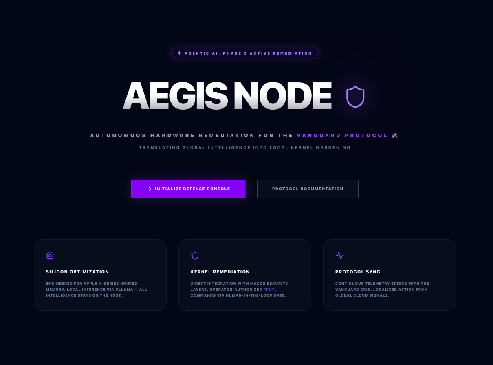
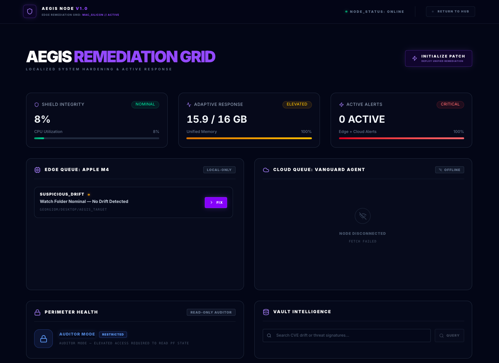
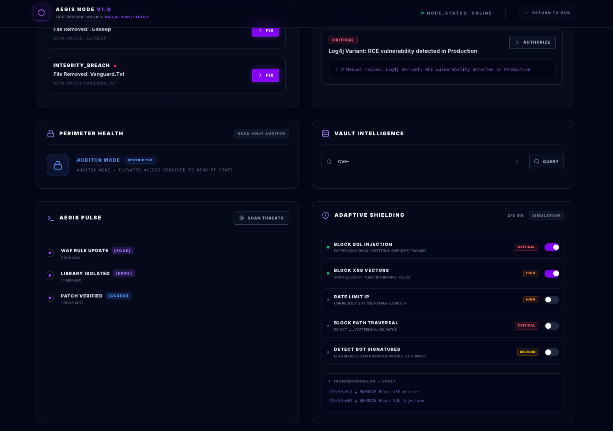
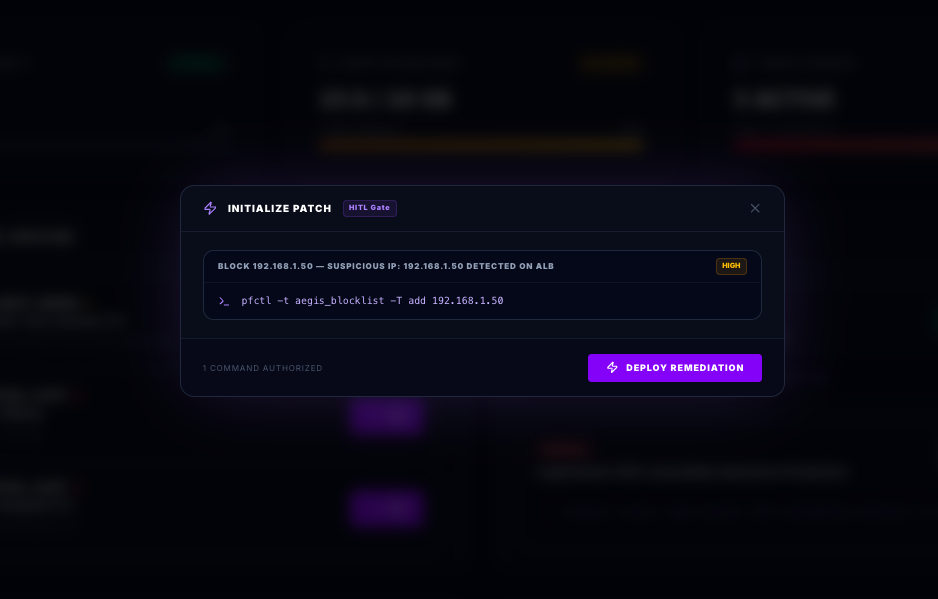

# ⬢ Aegis Node: Autonomous Remediation & Multi-Layer Hardening

**Agentic AI - Phase 3 Active Remediation | Next.js 16 | Ollama Llama-3 | Unified Memory Optimized | macOS Native Enforcement | Response Layer for the Vanguard Protocol**

## What is Aegis Node?

**While Vanguard provides passive observation and reconnaissance, Aegis executes autonomous remediation and perimeter hardening at the edge.**

Aegis is the **Active Remediation Node** of the ecosystem. It turns Vanguard's intelligence into automated threat neutralization through real-time patching, adaptive WAF rules, and self-healing infrastructure. It extends protection from the cloud perimeter down to edge hardware and kernel-level distributed systems on Apple Silicon (M4).

## What is Vanguard Protocol?

Protocol Definition: Vanguard is a decentralized intelligence grid providing real-time vulnerability reconnaissance. Aegis is the authorized remediation node for the local Mac-Silicon (M4) perimeter.

## 🛰️ System Identity

- **Ecosystem:** Vanguard Protocol
- **Role:** Active Defense / Autonomous Remediation
- **Primary Environment:** Apple Silicon (M4) Edge Node **(macOS Native)**

## 🛠️ Technical Stack

- **Framework:** Next.js 15 (App Router / React 18)
- **Engine:** Ollama (Llama-3-8B-Q4) for Local Intelligence
- **Database:** LanceDB (Embedded Vector Store for Local Sovereignty)
- **Sandbox:** OrbStack (Containerized Node.js Environment)
- **Styling:** Tailwind CSS + Lucide React

## 🖼️ Product Snapshot

> Aegis Node - Landing Page

### 

> Aegis Node - Defense Console

### 

### 

### 

### 

## 🔒 Safety & Isolation

### Firewall Audit — Read-Only, Always

`getFirewallStatus()` (`src/actions/firewall.ts`) calls `pfctl -s info` — the information-only flag. Hard constraints:

- **Never** runs with `sudo`
- **Never** uses `-e` (enable), `-d` (disable), `-f` (load ruleset), or any write flag
- The UI shows **Auditor Mode** when elevated access is unavailable (normal in sandboxed/Docker environments)
- The action distinguishes `Permission denied` (expected) from unexpected failures

Aegis reads the perimeter — it does not own it.

### Adaptive Shielding — Simulation Layer

WAF rule toggles are **mock/simulation only**. No system calls, no kernel hooks, no network configuration is modified. Each toggle writes an enforcement event to LanceDB for audit trail. The **Simulation** badge in the UI makes this explicit at all times.

### Vault (LanceDB)

Runs embedded within the Next.js process. No external port, no remote connection, no credentials. Data stored at `data/vault/` — local only.

> [!TIP]
> **Architecture & Security Context:** For runtime flow diagrams covering WAF enforcement, vault logging, the Kinetic HITL gate, and the Red Team probe sequence, see [ARCHITECTURE_FLOWS.md](./ARCHITECTURE_FLOWS.md).
> For adversarial probe methodology, threat model, and control verification outcomes, see [SECURITY_ADVISORY.md](./SECURITY_ADVISORY.md) (AEGIS-ADV-003).
> For engineering rationale behind the pfctl advisory model, WAF Edge Runtime constraints, and vault zero-vector fallback, see [TECHNICAL_ADVISORY.md](./TECHNICAL_ADVISORY.md).

---

## 🚀 Pre-Flight Setup

### 1. Prerequisites

- **OrbStack:** Optimized Docker/Sandbox for Apple Silicon.
- **Ollama:** Native MacOS AI Engine.
- **AI Model:** Pull the 4-bit Llama-3 model:
  ```bash
  ollama pull llama3:8b-instruct-q4_K_M
  ```
