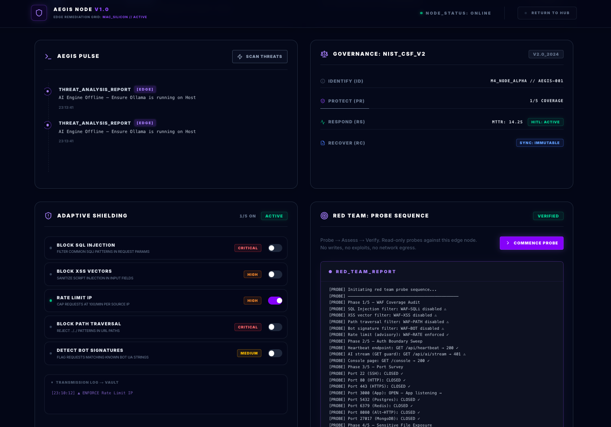
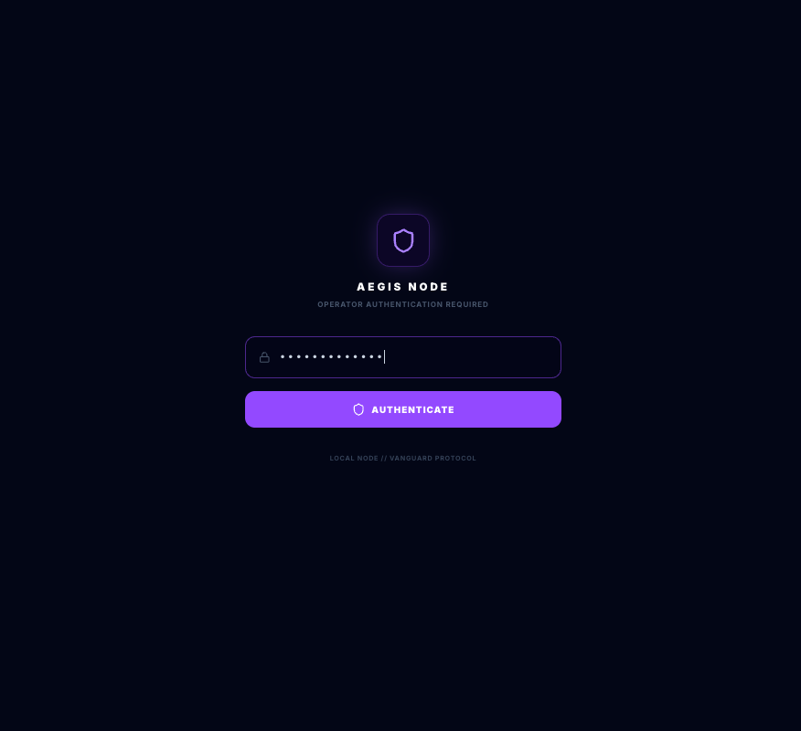
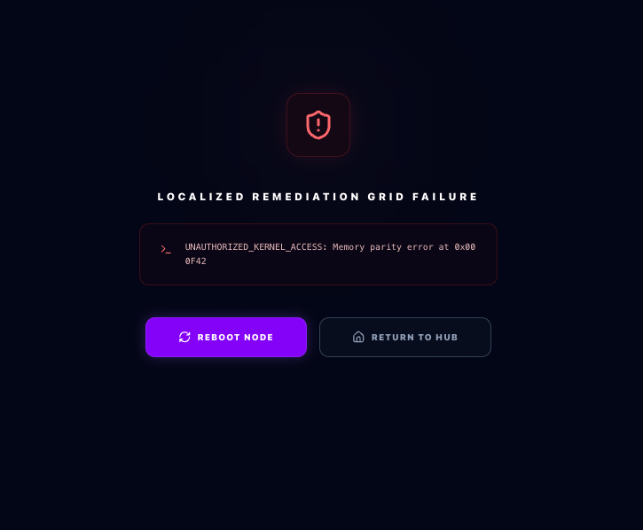
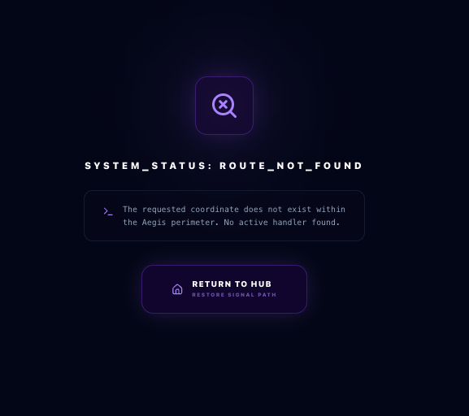

# ⬢ Aegis Node: Autonomous Remediation & Multi-Layer Hardening

**Agentic AI - Phase 3 Active Remediation | Next.js 15 | Ollama Llama-3 | Unified Memory Optimized | macOS Native Enforcement | Response Layer for the Vanguard Protocol**

## What is Aegis Node?

**While Vanguard provides passive observation and reconnaissance, Aegis executes autonomous remediation and perimeter hardening at the edge.**

Aegis is the **Active Remediation Node** of the ecosystem. It turns Vanguard's intelligence into automated threat neutralization through real-time patching, adaptive WAF rules, and self-healing infrastructure. It extends protection from the cloud perimeter down to edge hardware and kernel-level distributed systems on Apple Silicon (M4).

### What is Vanguard Protocol?

Protocol Definition: Vanguard is a decentralized intelligence grid providing real-time vulnerability reconnaissance. Aegis is the authorized remediation node for the local Mac-Silicon (M4) perimeter.

## 🧭 Engineering Philosophy

**Aegis Node** demonstrates that **Active Defense** does not require autonomous execution. By applying a **Human-in-the-Loop (HITL)** gate to every remediation command and keeping all intelligence local (no cloud APIs, no telemetry), this project provides a blueprint for **governed edge security** that prioritizes **Operator Authority**, **Execution Safety**, and **Local Sovereignty**.

---

## 🖼️ Product Snapshot

> Aegis Node - Landing Page

### 

> Aegis Node - Defense Console

### 

### 

### 

### 

### 

> Aegis Node - Login Page

### 

> Aegis Node - Error Page

### 

> Aegis Node - Not Found Page

### 

---

## 🛠️ Technical Stack

- **Framework:** Next.js 15 (App Router / React 18)
- **Engine:** Ollama (Llama-3-8B-Q4) for Local Intelligence
- **Database:** LanceDB (Embedded Vector Store for Local Sovereignty)
- **Sandbox:** OrbStack (Containerized Node.js Environment)
- **Styling:** Tailwind CSS + Lucide React

### 🛰️ System Identity

- **Ecosystem:** Vanguard Protocol
- **Role:** Active Defense / Autonomous Remediation
- **Primary Environment:** Apple Silicon (M4) Edge Node **(macOS Native)**

---

## 🏗️ Core Architecture

- **Edge-Middleware WAF:** Request inspection runs in the Next.js Edge Runtime (middleware.ts) before every route. Pattern-matching rules (SQLi, XSS, PATH traversal, Bot signatures) are applied to URL + query string + User-Agent. Matched requests receive a `403` with `X-Aegis-WAF: <rule-id>`.
- **HITL Kinetic Gate:** pfctl commands are derived from Vanguard alerts by `buildKineticCommands()` with `authorized: false`. No command executes automatically — the operator must Authorize, open PatchModal, and copy-paste into their own terminal.
- **Vault Memory (LanceDB):** Every remediation event is embedded via Ollama (4096-dim) and stored as a `RemediationSignature`. Zero-vector fallback ensures logging continues when Ollama is offline. The vault is append-only and supports semantic similarity search.
- **Local AI Inference (Ollama):** All LLM calls route to `host.docker.internal:11434` — no Anthropic, OpenAI, or external API. The model (`llama3:8b-instruct-q4_K_M`) runs inside the OrbStack sandbox. No prompt data or telemetry leaves the host network.
- **Red Team Self-Probe:** Read-only Probe → Assess → Verify sequence. The Probe phase runs five checks (WAF coverage → auth boundary → port survey → file exposure → security headers), followed by an AI posture assessment and a Verify summary. All probe functions accept injected fetcher/connector interfaces for offline testability.
- **Heartbeat Polling:** `useAegisPulse()` polls `/api/heartbeat` every 5 seconds via `Promise.all` across four data sources: `sysctl`/`vm_stat` (hardware metrics), `pfctl -s info` (firewall), file integrity scanner (edge alerts), and Vanguard feed (cloud alerts).
- **Vanguard Protocol Integration:** Cloud alert feed from Vanguard is ingested on every heartbeat. Alerts are stable-ID'd via content hash, acknowledged to disk (`data/.ack-file.json`), and filtered from the Cloud Queue after deploy.
- **Server-First Architecture:** All hardware reads, vault writes, and WAF config persistence run as Next.js Server Actions. No sensitive system data is fetched client-side. The Edge Runtime gate runs before server logic, not inside it.
- **Streaming AI Output:** All AI responses (remediation plans, threat scans, red team posture assessment) stream token-by-token via `ReadableStream`. The UI appends chunks in real time — no full-response wait.
- **Modular Extraction Pattern & SoC:** Files approaching ~150 lines are split into [feature].types.ts, [feature].hooks.ts, and [feature].utils.ts. This maintains strict SoC, keeping each concern independently testable and the UI declarative while isolating business logic to enable high-coverage unit testing.

---

### 🔒 Safety & Isolation

#### Firewall Audit — Read-Only, Always

`getFirewallStatus()` (`src/actions/firewall.ts`) calls `pfctl -s info` — the information-only flag. Hard constraints:

- **Never** runs with `sudo`
- **Never** uses `-e` (enable), `-d` (disable), `-f` (load ruleset), or any write flag
- The UI shows **Auditor Mode** when elevated access is unavailable (normal in sandboxed/Docker environments)
- The action distinguishes `Permission denied` (expected) from unexpected failures

Aegis reads the perimeter — it does not own it.

#### Adaptive Shielding — Real Enforcement

WAF rule toggles are **live middleware enforcement**. Each toggle persists the rule state to `data/.waf-config.json` (disk) and syncs it to the `aegis-waf` httpOnly cookie that Next.js middleware reads on every request. Enabled rules are applied in the Edge Runtime before any route logic — matched requests receive a `403` with `X-Aegis-WAF: <rule-id>`. Every toggle is also logged to the vault for audit continuity. See `TECHNICAL_ADVISORY.md` for WAF-RATE and POST body inspection constraints.

#### Vault (LanceDB)

Runs embedded within the Next.js process. No external port, no remote connection, no credentials. Data stored at `data/vault/` — local only.

---

## 🚀 Project Roadmap

- [x] **Edge WAF Enforcement:** Next.js middleware pattern-matching (SQLi, XSS, PATH traversal, Bot signatures) with cookie-based state persistence across Edge Runtime boundary.
- [x] **Kinetic HITL Gate:** Vanguard alert → pfctl command derivation → operator authorization → PatchModal copy flow. No autonomous firewall execution.
- [x] **LanceDB Vault:** Append-only remediation memory with Ollama embeddings, zero-vector fallback, and semantic similarity search.
- [x] **Live Heartbeat:** 5-second polling loop across hardware metrics, firewall status, file integrity scanner, and Vanguard cloud feed.
- [x] **Vanguard Protocol Integration:** Cloud alert ingestion, stable content-hash IDs, disk-persisted acknowledgement, and immediate client-side suppression after deploy.
- [x] **Adaptive Shield (WAF Toggles):** Per-rule enable/disable with disk + cookie persistence, logged to vault on every change.
- [x] **Defense Log + AI Threat Scan:** Live vault feed with on-demand AI posture assessment streamed from Ollama. Captured in collapsible Threat Analysis blocks.
- [x] **Red Team Probe Sequence:** Read-only self-probe (Probe → Assess → Verify) with streaming terminal output and AI synthesis.
- [x] **Unit Test Suite:** Vitest suites — all offline, injectable dependencies. WAF patterns, probe logic, kinetic bridge, vault, alert IDs, Defense Log utils.
- [x] **CI/CD:** GitHub Actions — Security Audit, ESLint, TypeScript strict check, and Vitest on every push to `main`.
- [x] **Architecture & Security Docs:** `ARCHITECTURE_FLOWS.md` (8 Mermaid diagrams), `SECURITY_ADVISORY.md` (AEGIS-ADV-003), `TECHNICAL_ADVISORY.md`.
- [x] **Playwright e2e:** Console layout, Red Team PROBE/ASSESS/VERIFY flow, WAF toggle → badge change, Defense Log scan trigger.
- [ ] **Auth hardening (optional):** Consider replacing HMAC session cookie with a lightweight provider (e.g. Clerk) if multi-user or SSO support is needed; current single-operator posture is sufficient for local node use.

---

> [!TIP]
> **Architecture & Security Context:** For runtime flow diagrams covering WAF enforcement, vault logging, the Kinetic HITL gate, and the Red Team probe sequence, see [ARCHITECTURE_FLOWS.md](./ARCHITECTURE_FLOWS.md).
> For adversarial probe methodology, threat model, and control verification outcomes, see [SECURITY_ADVISORY.md](./SECURITY_ADVISORY.md) (AEGIS-ADV-003).
> For engineering rationale behind the pfctl advisory model, WAF Edge Runtime constraints, and vault zero-vector fallback, see [TECHNICAL_ADVISORY.md](./TECHNICAL_ADVISORY.md).

---

## 🕹️ Tactical Operations Guide - How to Engage the Defense Console

Aegis is most effective when used with one clear objective per session. Use the console for concrete, targeted remediation actions. Follow these specific card-based patterns to maintain a hardened edge perimeter.

### A) Immediate Triage & Remediation (The Edge/Cloud Queues)

After the console loads, use it to:

1. **Identify Activity:** Review the Shield Integrity and Active Alerts metric cards. Check the **Edge Queue** for new integrity alerts and cross-reference with **Cloud Queue** Vanguard signals to distinguish local drift from remote threat activity.

2. **Review Recommendations**  
   When Vanguard surfaces a new threat, the Cloud Queue generates a derived `pfctl` command. Read the command, understand the IP or target, then decide whether to **Authorize** before opening the Patch Modal.

3. **Execute with HITL Discipline**  
   Open the **Initialize Patch** modal, copy the command manually, and run it in your own terminal. Aegis never executes firewall rules on your behalf — operator intent is the execution layer.

4. **Log and Audit**  
   Every authorized command is logged to the Vault before the modal closes. The **Defense Log** reflects the action in the live feed automatically. Verify timestamps match your manual execution.

### B) Red Team Operator Workflow

Use the Red Team panel for periodic self-assessment:

1. **Commence Probe:** Click "Commence Probe" to initiate the Probe → Assess → Verify sequence.
2. **Review Findings:** Audit WAF coverage gaps (`⚠`) and file exposure failures (`✗`) that may require immediate action; open ports (`→`) are informational. Read the AI posture assessment as an operator brief to understand the current risk surface.
3. **Verify Configuration:** Run a probe after any manual rule change (like enabling/disabling WAF toggles) to verify the change is reflected in the node's defense posture.

### C) Compliance and Audit Workflow

1. **Semantic Retrieval:** Use natural language queries in **VaultSearch** to surface past decisions ("show remediations for port scans from last week").
2. **Threat Narratives:** Click **Scan Threats** in the Defense Log to generate an AI-synthesized surface analysis suitable for incident handoffs or tickets.
3. **Provenance:** Treat Vault entries as append-only evidence—preserving who authorized a command, which target was impacted, and the precise outcome.

### D) Good Usage Practices

To get reliable value:

- Run the Red Team probe at the start of a session and after any infrastructure change.
- Keep WAF toggles intentional — every change is logged to the Vault and reflected in Red Team probe output.
- Treat `⚠ warn` probe results as investigation leads. A missing security header is not a breach; an exposed `.env` file is.
- Do not rely on AI threat summaries alone — they summarize telemetry, they do not replace it.

### E) What Aegis Is Not

Aegis is not an autonomous firewall manager.  
Its purpose is governed edge hardening with operator authority and auditable decision flow at the center. No system state changes without an explicit human action.

✅ **Operator note:** When authorizing a Kinetic command, read the full pfctl command before clicking Authorize. The command is constructed from the Vanguard alert's source IP or target field. Verify the IP is what you expect before executing it in your terminal.

---

## ✅ Operational Validation

Aegis is validated across WAF enforcement, HITL safety, vault integrity, and red team probe accuracy.

- **WAF Pattern Test:** Send a request with `?q=UNION+SELECT+*+FROM+users` to any console route.
  - **Expect:** `403 Forbidden` with `X-Aegis-WAF: WAF-SQLi` header. The request never reaches the route handler.

- **HITL Gate Test:** Authorize a Kinetic command in the Cloud Queue, open Initialize Patch, observe the pfctl command in the modal.
  - **Expect:** Command is displayed with a copy button and a "Logged to vault — firewall execution requires sudo" sublabel. No firewall change occurs until you manually run the command.

- **Red Team Probe Test:** Click Commence Probe with all WAF rules disabled.
  - **Expect:** All WAF rules appear as `⚠ disabled`. Auth boundary shows `/api/heartbeat → 200 ✓`. File exposure shows `.env → Not served (404) ✓`. AI ASSESS phase streams a posture summary.

- **Vault Semantic Search Test:** Resolve an Edge Queue alert, then search "file integrity" in VaultSearch.
  - **Expect:** The vault returns the logged remediation record with a similarity score, even if the exact wording differs from the stored action.

- **Ollama Offline Resilience:** Stop Ollama and click Scan Threats in the Defense Log.
  - **Expect:** The AI panel displays "AI Engine Offline — Ensure Ollama is running on Host" without crashing the component or the page.

## ⚡ Red Team Validation

Aegis includes a built-in self-probe capability that runs a read-only Probe → Assess → Verify sequence against the local node. It verifies WAF coverage, auth boundary behavior, open ports, sensitive file exposure, and security header posture — then feeds all findings to the local Ollama instance for AI-driven risk summarization.

See [`SECURITY_ADVISORY.md`](./SECURITY_ADVISORY.md) (AEGIS-ADV-003) for probe methodology, threat model, and control verification outcomes.

---

## 🚦 Getting Started

Follow this four-stage protocol to initialize the Aegis Node and verify its active defense layers.

### 1. Environment Initialization

```bash
git clone https://github.com/GeorgiDS9/aegis-node
cd aegis-node
npm install
```

### 2. Infrastructure Configuration

Aegis requires no API keys — all intelligence runs locally. You will need:

**OrbStack** (Docker sandbox, Apple Silicon optimized):

```bash
# Install from https://orbstack.dev, then:
docker-compose up
```

**Ollama** (local AI engine, macOS native):

```bash
# Install from https://ollama.com, then pull the inference model:
ollama pull llama3:8b-instruct-q4_K_M
```

Ollama must be running on `localhost:11434` before starting the dev server. The application bridges to it at `host.docker.internal:11434` from inside the OrbStack sandbox.

### 3. Development Mode

```bash
npm run dev
```

Open [http://localhost:3000](http://localhost:3000) for the landing page. The defense console is at `/console`.

---

### 4. Automated Security Audits

Aegis uses **Vitest** for fast offline unit tests covering probe logic, WAF pattern matching, kinetic command generation, vault operations, and Defense Log utilities. **GitHub Actions** runs lint, TypeScript strict check, security audit, and unit tests on every push and pull request to `main`.

**Unit tests (Vitest)**

```bash
npm test               # single run
npm test -- --watch    # watch mode
```

All tests are offline — no Ollama or LanceDB required.

| Suite               | What it covers                                                |
| ------------------- | ------------------------------------------------------------- |
| `waf-patterns`      | WAF regex patterns (SQLi, XSS, PATH, BOT)                     |
| `defense-log.utils` | Log mapping, time formatting, AI context builder              |
| `red-team-probes`   | WAF audit, auth boundary, port survey, file exposure, headers |
| `kinetic-bridge`    | pfctl command derivation and HITL defaults                    |
| `alert-id`          | Stable content-hash alert ID generation                       |
| `vault`             | LanceDB logging, embedding fallback, semantic search          |

**End-to-end (Playwright)**

Three specs — console layout, Red Team PROBE/ASSESS/VERIFY flow, and WAF toggle → badge change. All API calls are mocked for deterministic offline CI runs. Auth is handled via a global setup that logs in once and shares session state across specs.

**CI (GitHub Actions)**

Five gates run in parallel on every push:

| Job                     | What it checks                                      |
| ----------------------- | --------------------------------------------------- |
| Security Audit          | `npm audit --audit-level=high`                      |
| Clinical Code Standards | ESLint strict (Next.js flat config)                 |
| TypeScript Strict Check | `tsc --noEmit`                                      |
| Unit Tests              | Vitest (`npm test`)                                 |
| E2E Tests               | Playwright — console, red team, WAF toggle (mocked) |

---

### 🔐 Operator Authentication (Optional)

To access the Defense Console locally, use the operator PIN defined in your environment:

- **Login URL:** `http://localhost:3000/login`
- **Operator PIN:** `AEGIS_OPERATOR_PIN` (As defined in your `.env` file)
